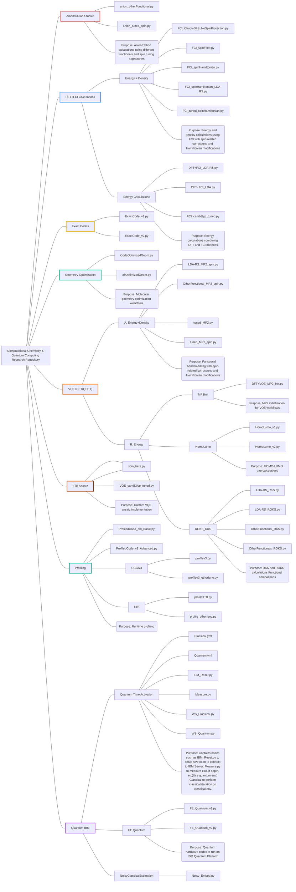

```mermaid
graph LR
    Root["Computational Chemistry & Quantum Computing Research Repository"]
    
    %% Anion/Cation Studies (Red)
    Root --- A["Anion/Cation Studies"]
    style A stroke:#EF4444,stroke-width:3px
    A --- A1["anion_otherFunctional.py"]
    A --- A2["anion_tuned_spin.py"]
    A --- A3("Purpose: Anion/Cation calculations using different functionals and spin tuning approaches")

    %% DFT+FCI Calculations (Blue)
    Root --- B["DFT+FCI Calculations"]
    style B stroke:#3B82F6,stroke-width:3px
    B --- B1["Energy + Density"]
    B1 --- B1_1["FCI_ChupinDIIS_NoSpinProtection.py"]
    B1 --- B1_2["FCI_spinFilter.py"]
    B1 --- B1_3["FCI_spinHamiltonian.py"]
    B1 --- B1_4["FCI_spinHamiltonian_LDA-RS.py"]
    B1 --- B1_5["FCI_tuned_spinHamiltonian.py"]
    B1 --- B1_6("Purpose: Energy and density calculations using FCI with spin-related corrections and Hamiltonian modifications")
    
    B --- B2["Energy Calculations"]
    B2 --- B2_1["DFT+FCI_LDA-RS.py"]
    B2 --- B2_2["DFT+FCI_LDA.py"]
    B2 --- B2_3["FCI_camb3lyp_tuned.py"]
    B2 --- B2_4("Purpose: Energy calculations combining DFT and FCI methods")
    
    %% Exact Codes (Yellow)
    Root --- C["Exact Codes"]
    style C stroke:#EAB308,stroke-width:3px
    C --- C1["ExactCode_v1.py"]
    C --- C2["ExactCode_v2.py"]
    
    %% Geometry Optimization (Green)
    Root --- D["Geometry Optimization"]
    style D stroke:#10B981,stroke-width:3px
    D --- D1["CodeOptimizedGeom.py"]
    D --- D2["allOptimizedGeom.py"]
    D --- D3("Purpose: Molecular geometry optimization workflows")
    
    %% VQE+DFT(QDFT) (Orange)
    Root --- E["VQE+DFT(QDFT)"]
    style E stroke:#F97316,stroke-width:3px
    E --- E1["A. Energy+Density"]
    E1 --- E1_1["LDA-RS_MP2_spin.py"]
    E1 --- E1_2["OtherFunctional_MP2_spin.py"]
    E1 --- E1_3["tuned_MP2.py"]
    E1 --- E1_4["tuned_MP2_spin.py"]
    E1 --- E1_5("Purpose: Functional benchmarking with spin-related corrections and Hamiltonian modifications")
    
    E --- E2["B. Energy"]
    E2 --- E2_1["MP2Init"]
    E2_1 --- E2_1a["DFT+VQE_MP2_Init.py"]
    E2_1 --- E2_1b("Purpose: MP2 initialization for VQE workflows")
    
    E2 --- E2_2["HomoLumo"]
    E2_2 --- E2_2a["HomoLumo_v1.py"]
    E2_2 --- E2_2b["HomoLumo_v2.py"]
    E2_2 --- E2_2c("Purpose: HOMO-LUMO gap calculations")
    
    E2 --- E2_3["ROKS_RKS"]
    E2_3 --- E2_3a["LDA-RS_RKS.py"]
    E2_3 --- E2_3b["LDA-RS_ROKS.py"]
    E2_3 --- E2_3c["OtherFunctional_RKS.py"]
    E2_3 --- E2_3d["OtherFunctionals_ROKS.py"]
    E2_3 --- E2_3e("Purpose: RKS and ROKS calculations Functional comparisons")
    
    %% IITB Ansatz (Brown)
    Root --- G["IITB Ansatz"]
    style G stroke:#92400E,stroke-width:3px
    G --- G1["IITB_Ansatz.py"]
    G --- G2["VQE_camB3lyp_tuned.py"]
    G --- G3("Purpose: Custom VQE ansatz implementation")
    
    %% Profiling (Teal)
    Root --- H["Profiling"]
    style H stroke:#0D9488,stroke-width:3px
    H --- H1["ProfiledCode_old_Basic.py"]
    H --- H2["ProfiledCode_v2_Advanced.py"]
    H --- H3["UCCSD"]
    H3 --- H3_1["profilev3.py"]
    H3 --- H3_2["profilev3_otherfunc.py"]
    H  --- H4["IITB"]
    H4 --- H4_1["profileIITB.py"]
    H4 --- H4_2["profile_otherfunc.py"]
    H --- H5("Purpose: Runtime profiling")
    
    %% Quantum IBM (Purple)
    Root --- F["Quantum IBM"]
    style F stroke:#A855F7,stroke-width:3px
    F --- F1["Quantum Time Activation"]
    F1 --- F1_1["Classical.yml"]
    F1 --- F1_2["Quantum.yml"]
    F1 --- F1_3["IBM_Reset.py"]
    F1 --- F1_4["Measure.py"]
    F1 --- F1_5["WS_Classical.py"]
    F1 --- F1_6["WS_Quantum.py"]
    F1 --- F1_7("Purpose: Contains codes such as IBM_Reset.py to setup API token to connect to IBM Server. Measure.py to measure circuit depth, etc(Use quantum env) Classical to perform classical iteration on classical env.")
    
    F --- F2["FE Quantum"]
    F2 --- F2_1["FE_Quantum_v1.py"]
    F2 --- F2_2["FE_Quantum_v2.py"]
    F2 --- F2_3("Purpose: Quantum hardware codes to run on IBM Quantum Platform")

    F --- F3["NoisyClassicalEstimation"]
    F3 --- F3_1["Noisy_Embed.py"]

    %% SpinHamiltonian (Yellow)
    G --- G1["spin_beta.py"]

```
